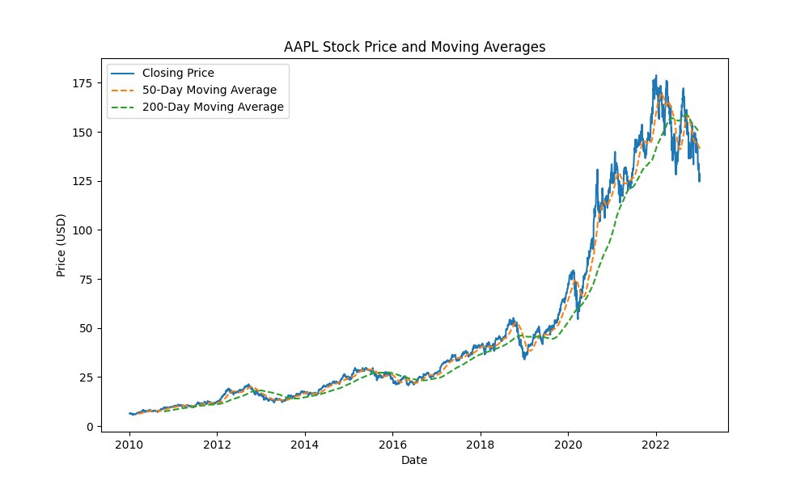

# Stock Price Analysis and Forecasting  

This project collects stock data, analyzes trends, and predicts future stock prices using Python. It utilizes Yahoo Finance, data visualization, and the ARIMA model for forecasting.

## Installation  
Make sure you have Python installed. Then, install the required libraries:  

```bash
pip install yfinance pandas matplotlib statsmodels numpy


---

### **📌 Step 5: How to Use the Project**  
Explain how users can run the script.  

```markdown
## Usage  
1. Clone the repository:  
   ```bash
   git clone https://github.com/yourusername/yourrepo.git
   cd yourrepo


---

## 📌 Step 6: Features of Your Project  
Highlight what your project does.  

```markdown
## Features  
✅ Fetches historical stock data from Yahoo Finance  
✅ Cleans and processes stock market data  
✅ Visualizes closing price trends with moving averages  
✅ Uses ARIMA for forecasting future stock prices  
✅ Generates interactive graphs for insights  


## Example Output  
Here’s a sample stock price trend:  




  

  


